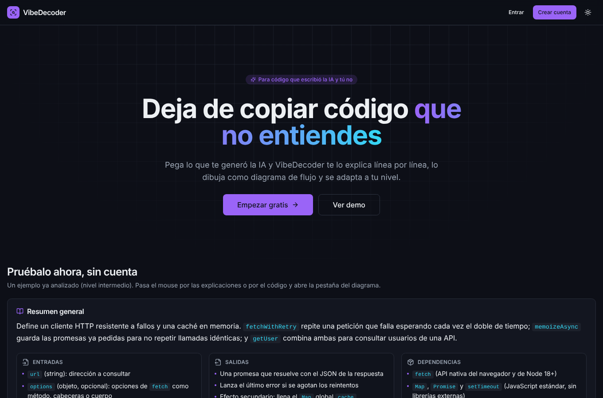
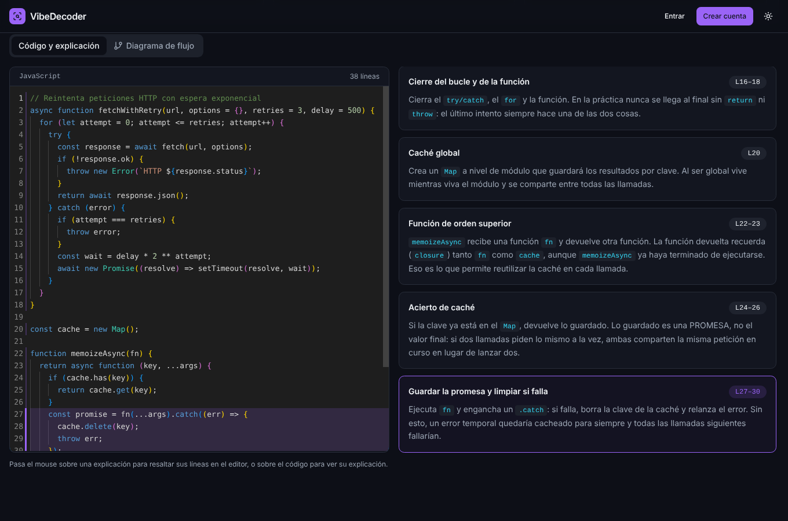
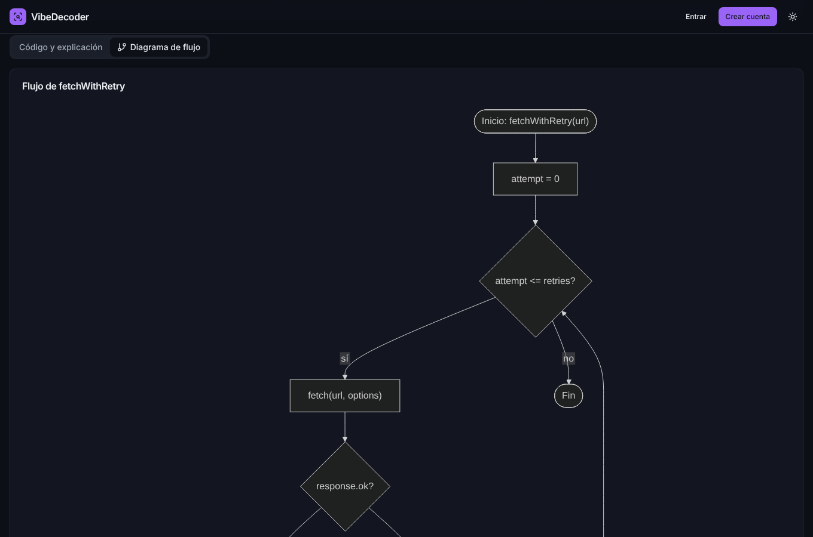
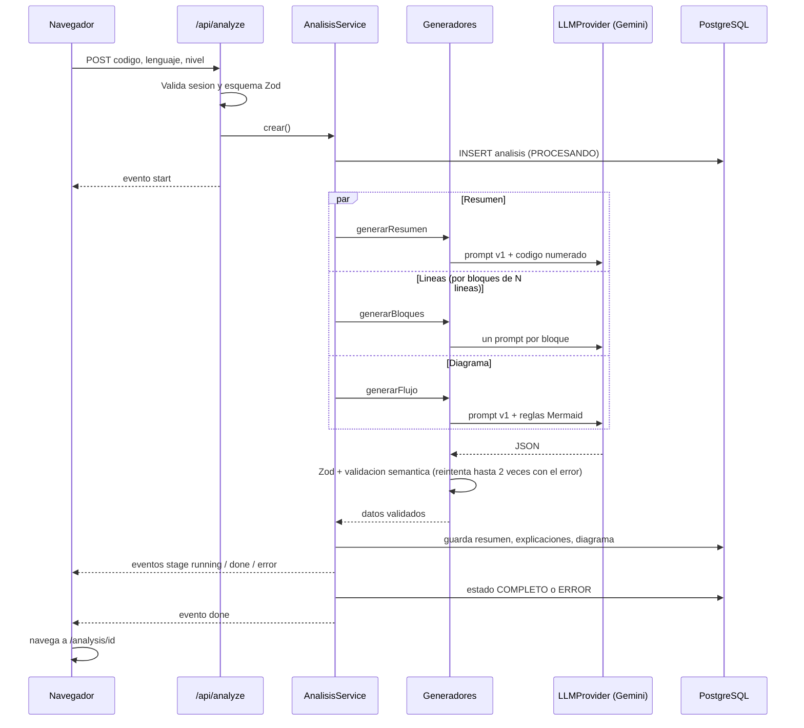
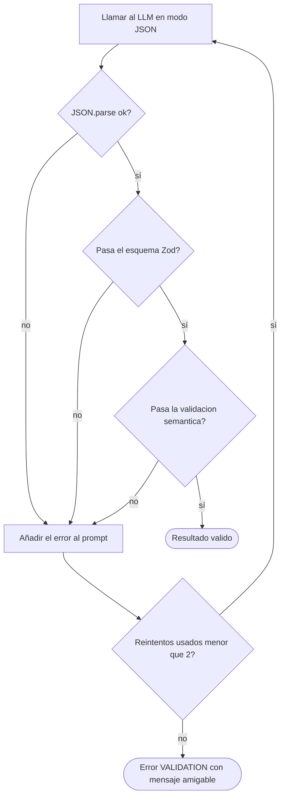

# VibeDecoder

> Entiende el código que generó la IA: explicación línea por línea, diagramas de flujo y (próximamente) auditoría y quiz de comprensión.

Proyecto final de **Programación Orientada a la Web**. Estado actual: **Fase 1 de 3**.

| Fase | Contenido | Estado |
|------|-----------|--------|
| 1 | Auth, BD, editor Monaco, Gemini, resumen + explicación línea por línea sincronizada, diagrama de flujo, historial, despliegue | Hecha |
| 2 | Quiz con calificación, auditoría de vibe code, glosario, caché y rate limiting | Pendiente |
| 3 | Chat contextual, dashboard de progreso, exportar/compartir, respaldo Groq, tests completos, README final | Pendiente |

## El problema

Los desarrolladores copian código generado por IA que funciona pero no entienden. Eso crea deuda técnica, errores de seguridad invisibles y personas que dependen de la IA sin aprender.

## La solución

El usuario pega código (editor, archivo o Gist) y VibeDecoder produce, adaptado a su nivel (principiante, intermedio o avanzado): un resumen general, una explicación por bloques con resaltado sincronizado entre código y explicación, y un diagrama de flujo en Mermaid. Las fases siguientes añaden auditoría de «vibe code» y un quiz que verifica la comprensión.

## Capturas

| Landing con demo | Resaltado sincronizado | Diagrama |
|---|---|---|
|  |  |  |

## Stack

Next.js 15 (App Router) · TypeScript · TailwindCSS 3 + componentes estilo shadcn/ui · Monaco Editor · Mermaid · Auth.js v5 · Prisma 7 + PostgreSQL (Supabase o Neon) · Zod · Vitest · Google Gemini (Groq como respaldo en la Fase 3) · Vercel.

## Arquitectura

```
app/                  Rutas (App Router) y API routes (todas las llamadas al LLM pasan por aquí)
  api/analyze         POST: crea el análisis y responde por streaming NDJSON (progreso por etapas)
  api/analysis/[id]   DELETE, /regenerar (reintenta una etapa), /diagrama (corrige Mermaid con IA)
  api/gist            GET: importa un Gist público (host fijo, anti-SSRF)
  api/register|perfil Registro y nivel del usuario
components/           UI (ui/ = base estilo shadcn), visor dividido, formulario, Mermaid
lib/llm/              LLMProvider (interfaz), GeminiProvider, generateJson (Zod + reintentos)
lib/prompts/v1/       Prompts del sistema en archivos separados y versionados
services/             AnalisisService (orquestación + BD), usuarios, generators/ (POO)
schemas/              Esquemas Zod (entrada del usuario y salida del LLM)
prisma/               schema.prisma (12 tablas)
tests/                Vitest
```

### Clases principales (POO)

- `LLMProvider` (interfaz) → `GeminiProvider`. Los generadores dependen de la interfaz, no del proveedor.
- `GeneradorBase` → `GeneradorExplicacion` (resumen + bloques), `GeneradorDiagrama` (flujo + reparación). `GeneradorQuiz` y `AuditorCodigo` llegan en la Fase 2 sobre la misma base.
- `AnalisisService` crea el análisis, ejecuta las etapas en paralelo, persiste cada resultado y permite regenerar una sola etapa.

### Flujo de llamadas al LLM



### Robustez de las respuestas del LLM



La validación semántica comprueba, por ejemplo, que los bloques estén dentro del rango de líneas pedido, cubran al menos el 70 % del código y que el Mermaid tenga encabezado, flechas y comillas balanceadas. Los solapes entre bloques se corrigen de forma determinista. Después, el cliente valida el diagrama con `mermaid.parse()` antes de dibujarlo; si falla, ofrece «Corregir con IA».

## Diagrama entidad-relación

Ver [docs/ER.md](docs/ER.md) (12 tablas: `usuarios`, `analisis`, `explicaciones_linea`, `conceptos`, `diagramas`, `hallazgos_auditoria`, `quizzes`, `preguntas`, `intentos_quiz`, `respuestas_usuario`, `mensajes_chat`, `uso_diario`).

## Decisiones técnicas

| Decisión | Por qué |
|---|---|
| API key solo en el servidor | Toda llamada al LLM ocurre en API routes; `import "server-only"` impide importar esos módulos desde el cliente. |
| `LLMProvider` como interfaz | Cambiar o añadir proveedores (Groq) sin tocar generadores ni servicios. |
| Gemini por REST sin SDK | Una dependencia menos y control completo de errores, reintentos y timeouts. |
| Modelo configurable (`GEMINI_MODEL`) | Los nombres de modelos y los planes gratuitos cambian con frecuencia. |
| JSON estricto + Zod + reintento con el error | Los LLM fallan en formato; el error concreto en el prompt corrige la mayoría de casos. |
| Prompts en `lib/prompts/v1` | Versionados: cada análisis guarda `versionPrompts` y se pueden comparar versiones. |
| Etapas en paralelo | Menor latencia (timeout serverless) y un fallo parcial no pierde el resto; se puede regenerar solo esa etapa. |
| Streaming NDJSON | Progreso por etapas sin WebSockets; funciona en funciones serverless. |
| Troceado por líneas | El límite crítico es el de tokens de salida (la explicación de 600 líneas no cabe en una respuesta). |
| Auth.js con JWT y sin adaptador | Credenciales exige JWT; los usuarios viven en nuestra tabla `usuarios`. |
| `auth.config.ts` separado | El middleware corre en Edge y no puede importar Prisma ni bcrypt. |
| Middleware y comprobación en cada ruta | Defensa en profundidad: el middleware no es la única barrera. |
| bcryptjs (costo 12) | JavaScript puro: funciona en cualquier runtime sin compilar módulos nativos. |
| Prisma 7 + `@prisma/adapter-pg` | Cliente sin binario de Rust, más ligero en serverless. |
| Monaco servido desde `/monaco` | Sin CDN: funciona en redes que lo bloquean y no depende de terceros. |
| Mermaid con `securityLevel: "strict"` | Sanea el SVG y desactiva `click` y HTML. Además se quitan `click` y `%%{init}` en el servidor. |
| Texto del LLM como nodos de React | Nunca `innerHTML`: no hay vía de inyección de HTML. El código del usuario nunca se ejecuta. |
| Demo precalculada | La landing funciona sin login y sin gastar cuota del LLM. |
| Prompt injection | El código va entre `<codigo>` marcado como dato no confiable, se neutralizan etiquetas de cierre y la salida se valida por esquema. |

## Instalación local (Windows, PowerShell)

Requisitos: Node.js 20.19 o superior (recomendado 22), una base PostgreSQL (Supabase o Neon, ver más abajo) y una API key de Gemini.

```powershell
cd VibeDecoder
copy .env.example .env.local
# edita .env.local con tus valores (ver tabla de variables)
npm install
npx prisma db push
npm run dev
```

Abre http://localhost:3100 si usas el puerto del ejemplo, o http://localhost:3000 por defecto. Otros comandos: `npm test`, `npm run typecheck`, `npm run build`.

> Si la carpeta está dentro de OneDrive, `npm install` puede ir muy lento porque OneDrive sincroniza `node_modules`. Pausa la sincronización mientras instalas o trabaja en una carpeta fuera de OneDrive (por ejemplo `C:\dev\VibeDecoder`).

### Variables de entorno

| Variable | Obligatoria | Descripción |
|---|---|---|
| `DATABASE_URL` | Sí | URL de la BD que usa la app (pooler). |
| `DIRECT_URL` | Sí (CLI) | URL directa o session pooler para `prisma db push`. |
| `AUTH_SECRET` | Sí | Secreto de Auth.js: `npx auth secret` o `openssl rand -base64 32`. |
| `AUTH_GITHUB_ID`, `AUTH_GITHUB_SECRET` | Para login con GitHub | Credenciales de la OAuth App. Sin ellas el botón de GitHub se oculta. |
| `LLM_PROVIDER` | No | `gemini` (por defecto). |
| `GEMINI_API_KEY` | Sí | Clave de Google AI Studio. |
| `GEMINI_MODEL` | No | Por defecto `gemini-3.5-flash-lite`. |
| `NEXT_PUBLIC_MAX_CODE_CHARS` | No | Tamaño máximo del código (20000 por defecto). |
| `LLM_CHUNK_LINES` | No | Líneas por bloque al dividir código largo (120). |
| `GITHUB_TOKEN` | No | Sube el límite de la API de GitHub al importar Gists. |

## Pruebas

`npm test` ejecuta 37 pruebas con Vitest: esquemas de entrada y salida, validación y reparación de bloques, troceado de código, hash de caché, normalización de Mermaid, detección de lenguaje y el bucle de reintentos con un proveedor falso. La calificación del quiz y la caché llegan con la Fase 2.

## Guía de despliegue

Ver [docs/GUIA-DESPLIEGUE.md](docs/GUIA-DESPLIEGUE.md): Supabase o Neon, Gemini, GitHub OAuth y Vercel paso a paso.

## Límites conocidos de la Fase 1

- Aún no hay límite diario de análisis ni caché por hash (Fase 2); el hash ya se guarda.
- No hay limitación de intentos de login (conviene añadirla antes de un uso público amplio).
- El diagrama de clases y el de secuencia llegan en la Fase 2.
