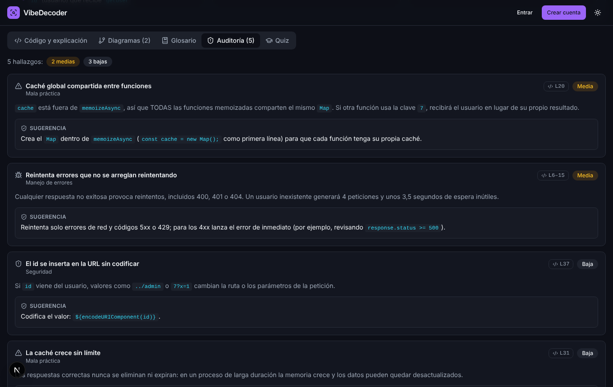
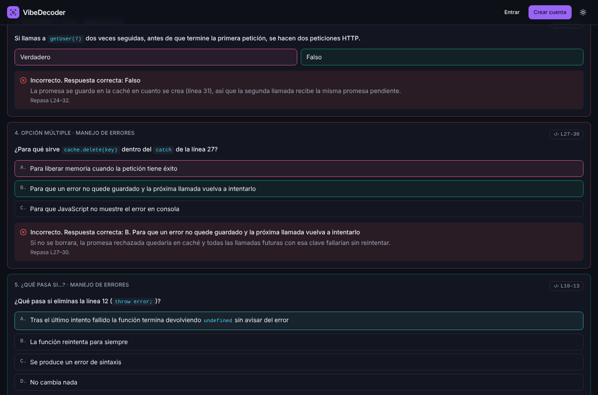
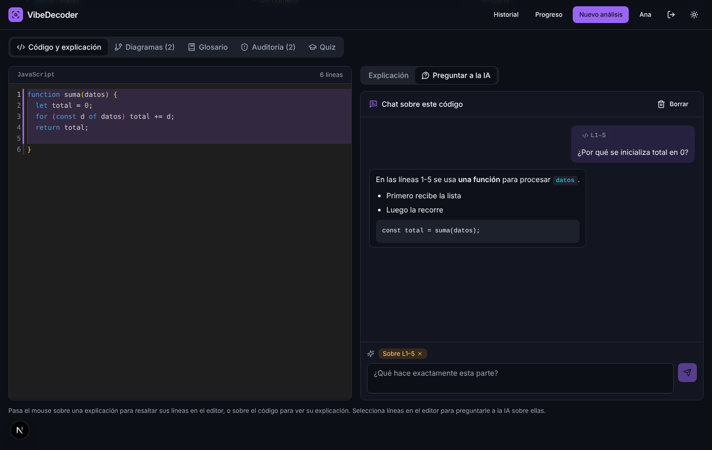
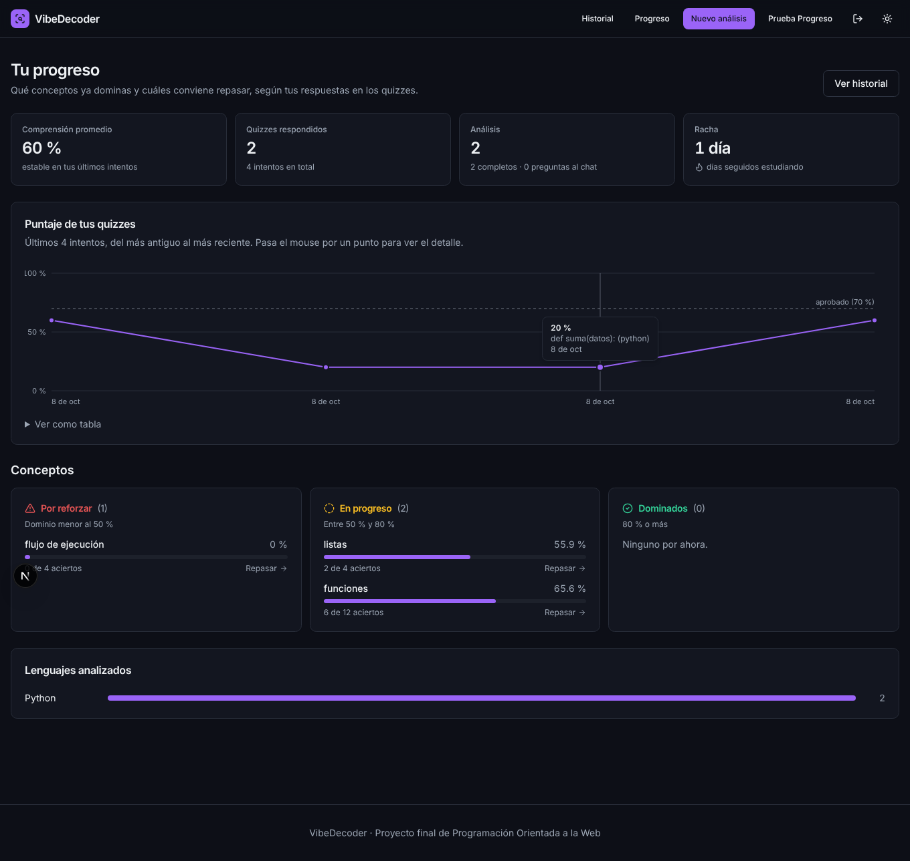
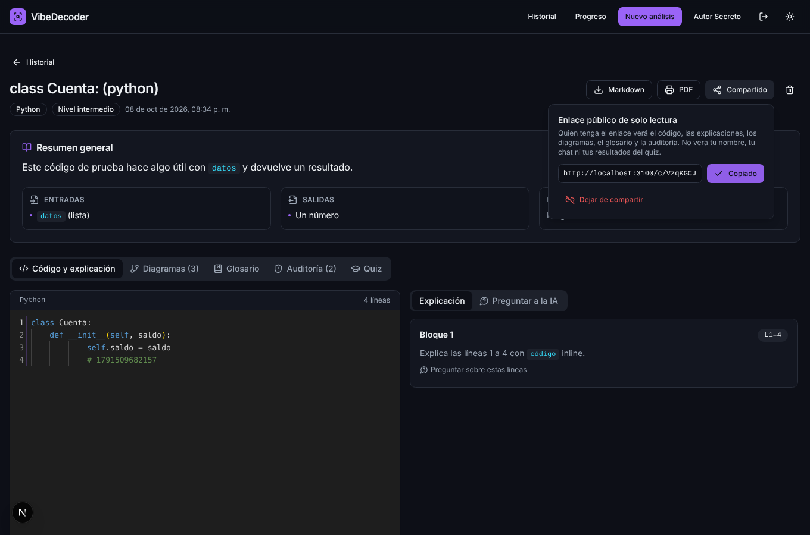
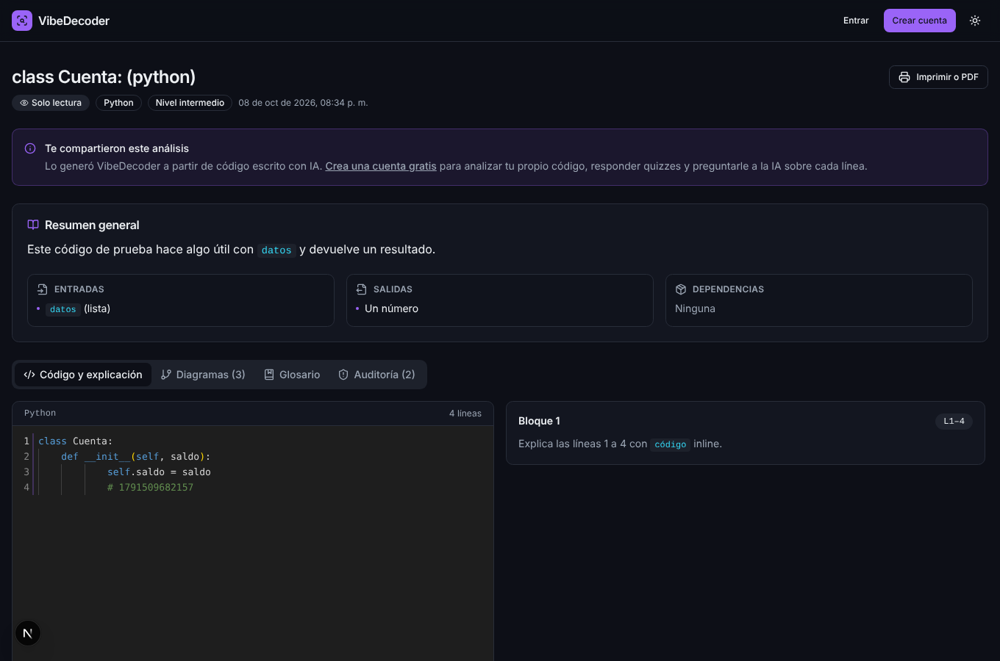
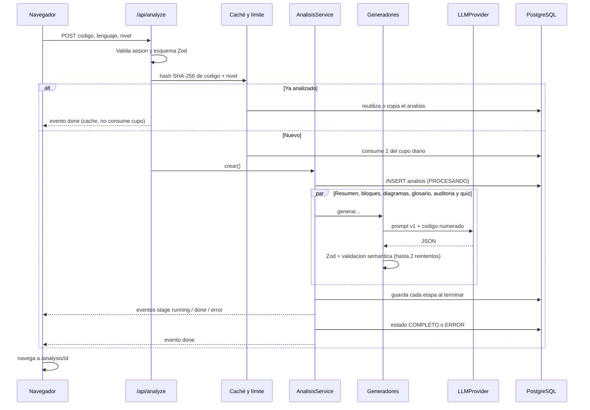
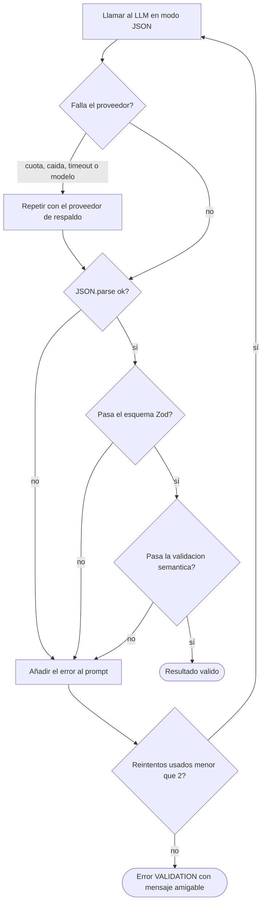

# VibeDecoder

> Entiende el código que generó la IA: explicación línea por línea, diagramas, glosario, auditoría de «vibe code», quiz de comprensión y un chat para preguntar sobre cualquier línea.

Proyecto final de **Programación Orientada a la Web**.

| Fase | Contenido | Estado |
|------|-----------|--------|
| 1 | Auth, BD, editor Monaco, Gemini, resumen + explicación línea por línea sincronizada, diagrama de flujo, historial, despliegue | Hecha |
| 2 | Quiz con calificación, auditoría de vibe code, glosario, diagramas de clases y secuencia, caché y límite diario | Hecha |
| 3 | Chat contextual, dashboard de progreso, exportar (Markdown/PDF) y compartir, respaldo con Groq, pruebas, README final | Hecha |

## El problema

Los desarrolladores copian código generado por IA que funciona pero no entienden. Eso crea deuda técnica, errores de seguridad invisibles y personas que dependen de la IA sin aprender.

## La solución

El usuario pega código (editor, archivo o Gist) y VibeDecoder lo analiza adaptándose a su nivel (principiante, intermedio o avanzado):

| Función | Qué hace |
|---|---|
| Resumen | Propósito, entradas, salidas y dependencias. |
| Explicación línea por línea | Vista dividida: código en Monaco a la izquierda, explicación por bloques a la derecha. Al pasar el mouse por un lado se resalta el otro. |
| Diagramas | Flujo siempre; clases y secuencia cuando el código los justifica. Validados con `mermaid.parse()` y con «Corregir con IA» si fallan. |
| Glosario | Conceptos usados en el código, con enlace a las líneas donde aparecen. |
| Auditoría de vibe code | Seguridad, malas prácticas, código muerto, manejo de errores y posibles alucinaciones de la IA (APIs que no existen), con severidad y sugerencia. |
| Quiz | 5 tipos de pregunta (opción múltiple, qué imprime, verdadero/falso, qué pasa si, ordenar pasos). Se califica en el servidor; si sacas menos del 70 % te dice qué líneas repasar. |
| Chat contextual | Selecciona líneas en el editor y pregunta sobre ellas. La conversación se guarda por análisis. |
| Progreso | Conceptos dominados, en progreso y por reforzar; evolución del puntaje; lenguajes; racha de días. |
| Exportar y compartir | Descarga en Markdown, versión para imprimir o guardar como PDF y enlace público de solo lectura que se puede revocar. |

## Capturas

| Landing con demo | Resaltado sincronizado | Diagrama |
|---|---|---|
|  |  |  |

| Auditoría | Quiz calificado | Chat sobre unas líneas |
|---|---|---|
|  |  |  |

| Progreso | Compartir | Vista pública |
|---|---|---|
|  |  |  |

Las capturas de la demo usan el análisis precalculado de la landing. Las de chat, progreso y compartir se tomaron en las pruebas locales con un servidor que simula al LLM, así que el texto de las respuestas es de prueba.

## Stack

Next.js 15 (App Router) · TypeScript · TailwindCSS 3 + componentes estilo shadcn/ui · Monaco Editor · Mermaid · Auth.js v5 · Prisma 7 + PostgreSQL (Supabase o Neon) · Zod · Vitest · Google Gemini (principal) y Groq (respaldo) · Vercel.

## Arquitectura

```
app/                      Rutas (App Router) y API routes (todas las llamadas al LLM pasan por aquí)
  api/analyze             POST: crea el análisis (o lo toma de la caché) y responde por streaming NDJSON
  api/analysis/[id]       DELETE · /regenerar · /diagrama · /quiz · /chat · /compartir · /exportar
  api/gist                GET: importa un Gist público (host fijo, anti-SSRF)
  api/register|perfil     Registro y nivel del usuario
  analysis/[id]           Visor (y /imprimir para PDF)
  c/[token]               Vista pública de solo lectura (y /imprimir)
  dashboard · progreso    Historial y dashboard de progreso
components/               UI (ui/ = base estilo shadcn), visor, paneles (viewer/), impresión, progreso
lib/llm/                  LLMProvider, GeminiProvider, GroqProvider, ProveedorConRespaldo, fábrica, generateJson
lib/prompts/v1/           Prompts del sistema en archivos separados y versionados
lib/                      Lógica pura y probada: quiz, caché, límites, progreso, exportar, chat, Mermaid…
services/                 Orquestación y acceso a BD (análisis, caché, límite, quiz, chat, progreso, compartir)
services/generators/      Generadores POO sobre GeneradorBase
schemas/                  Esquemas Zod (entrada del usuario y salida del LLM)
prisma/                   schema.prisma (12 tablas)
tests/                    Vitest
```

### Clases principales (POO)

- `LLMProvider` (interfaz) → `GeminiProvider`, `GroqProvider` y `ProveedorConRespaldo`, que envuelve a dos proveedores y cambia al segundo si el primero falla por cuota, caída, timeout, clave o modelo inexistente. La fábrica `crearProveedorDesdeEntorno` decide cuál usar según las variables de entorno. Nadie más sabe que hay dos proveedores.
- `GeneradorBase` (prompt de sistema, nivel, JSON validado con reintentos) → `GeneradorExplicacion` (resumen, bloques y glosario), `GeneradorDiagrama` (flujo, clases, secuencia y reparación), `AuditorCodigo` y `GeneradorQuiz`.
- `AnalisisService` crea el análisis, ejecuta las etapas en paralelo, persiste cada resultado y permite regenerar una sola etapa.

### Flujo de un análisis



### Robustez de las respuestas del LLM



La validación semántica comprueba, por ejemplo, que los bloques estén dentro del rango de líneas pedido y cubran al menos el 70 % del código, que el quiz tenga respuestas válidas para cada tipo de pregunta y que el Mermaid tenga encabezado, flechas y comillas balanceadas. Los rangos fuera del archivo y los solapes se corrigen de forma determinista en vez de gastar reintentos. Después, el cliente valida cada diagrama con `mermaid.parse()` antes de dibujarlo.

### Caché y límite diario

- Cada análisis guarda el hash SHA-256 del código normalizado más el nivel. Si alguien vuelve a analizar el mismo código con el mismo nivel y la misma versión de prompts, se reutiliza el resultado al instante sin llamar a la IA ni descontar del cupo. La opción «Ignorar caché» fuerza un análisis nuevo.
- Cupos por usuario y día en la tabla `uso_diario`: análisis nuevos (10 por defecto) y consultas secundarias a la IA, es decir regenerar, quiz nuevo, corregir diagrama y chat (60 por defecto). Si la llamada al LLM falla, la consulta se devuelve al cupo.

### Progreso

El dominio de cada concepto sale de las respuestas del quiz ligadas a ese concepto, con más peso para las recientes: si antes fallabas y ahora aciertas, sube. Desde 80 % se considera dominado y por debajo de 50 % se marca para reforzar; el enlace «Repasar» abre el análisis con las líneas de la pregunta fallada resaltadas (`/analysis/:id?l=3-9`). El promedio de comprensión usa el mejor intento de cada quiz.

### Exportar y compartir

- **Markdown**: documento con resumen, código, explicación por bloques (con su fragmento), diagramas en bloques ```` ```mermaid ```` (GitHub y Obsidian los dibujan), glosario, auditoría y el quiz **sin respuestas**.
- **PDF**: la página `/analysis/:id/imprimir` muestra todo en orden de lectura y en modo claro, y el diálogo de impresión del navegador lo guarda como PDF. No requiere librerías de PDF ni un navegador en el servidor (que no caben en el plan gratuito de Vercel).
- **Enlace público**: `/c/:token` con un token aleatorio de 192 bits (no el id). Es de solo lectura, no muestra el nombre del autor, el chat ni el quiz, no permite llamar a la IA, se marca `noindex` y se puede revocar.

## Diagrama entidad-relación

Ver [docs/ER.md](docs/ER.md) (12 tablas: `usuarios`, `analisis`, `explicaciones_linea`, `conceptos`, `diagramas`, `hallazgos_auditoria`, `quizzes`, `preguntas`, `intentos_quiz`, `respuestas_usuario`, `mensajes_chat`, `uso_diario`).

## Decisiones técnicas

| Decisión | Por qué |
|---|---|
| API keys solo en el servidor | Toda llamada al LLM ocurre en API routes; `import "server-only"` impide importar esos módulos desde el cliente. |
| `LLMProvider` como interfaz | Gemini, Groq y el respaldo son intercambiables sin tocar generadores ni servicios. |
| Respaldo como decorador (`ProveedorConRespaldo`) | El cambio de proveedor es transparente y solo ocurre en errores que no dependen del prompt. |
| REST sin SDK | Una dependencia menos y control completo de errores, reintentos y timeouts. |
| Modelos configurables (`GEMINI_MODEL`, `GROQ_MODEL`) | Los nombres de modelos y los planes gratuitos cambian con frecuencia. |
| JSON estricto + Zod + reintento con el error | Los LLM fallan en formato; el error concreto en el prompt corrige la mayoría de casos. |
| Chat en texto, no JSON | Es conversación; se muestra con un Markdown mínimo construido con nodos de React. |
| Prompts en `lib/prompts/v1` | Versionados: cada análisis guarda `versionPrompts` y la caché solo reutiliza resultados de la misma versión. |
| Etapas en paralelo | Menor latencia (timeout serverless) y un fallo parcial no pierde el resto; se puede regenerar solo esa etapa. |
| Streaming NDJSON | Progreso por etapas sin WebSockets; funciona en funciones serverless. |
| Troceado por líneas | El límite crítico es el de tokens de salida (la explicación de 600 líneas no cabe en una respuesta). |
| Quiz calificado en el servidor | El navegador nunca recibe las respuestas correctas antes de enviar. |
| Lógica pura en `lib/` | Calificación, caché, límites, progreso y exportación se prueban con Vitest sin BD ni red. |
| Auth.js con JWT y sin adaptador | Credenciales exige JWT; los usuarios viven en nuestra tabla `usuarios`. |
| `auth.config.ts` separado | El middleware corre en Edge y no puede importar Prisma ni bcrypt. |
| Middleware y comprobación en cada ruta | Defensa en profundidad: el middleware no es la única barrera y toda consulta filtra por `usuarioId`. |
| bcryptjs (costo 12) | JavaScript puro: funciona en cualquier runtime sin compilar módulos nativos. |
| Prisma 7 + `@prisma/adapter-pg` | Cliente sin binario de Rust, más ligero en serverless. |
| Monaco servido desde `/monaco` | Sin CDN: funciona en redes que lo bloquean y no depende de terceros. |
| Mermaid con `securityLevel: "strict"` | Sanea el SVG y desactiva `click` y HTML. Además se quitan `click` y `%%{init}` en el servidor. |
| Texto del LLM como nodos de React | Nunca `innerHTML`: no hay vía de inyección de HTML. El código del usuario nunca se ejecuta. |
| Gráfica de progreso en SVG propio | Una sola serie no justifica una librería de gráficos; incluye tooltip, foco con teclado y tabla alternativa. |
| PDF con el diálogo de impresión | Sin Puppeteer ni librerías pesadas en el servidor. |
| Demo precalculada | La landing funciona sin login y sin gastar cuota del LLM. |
| Prompt injection | El código y el historial del chat van entre etiquetas marcadas como dato no confiable, se neutralizan etiquetas de cierre y la salida se valida por esquema. |

## Instalación local (Windows, PowerShell)

Requisitos: Node.js 20.19 o superior (recomendado 22), una base PostgreSQL (Supabase o Neon) y una API key de Gemini. La de Groq es opcional (respaldo).

```powershell
cd VibeDecoder
copy .env.example .env.local
# edita .env.local con tus valores (ver tabla de variables)
npm install
npx prisma db push
npm run dev
```

Abre http://localhost:3000. Otros comandos: `npm test`, `npm run typecheck`, `npm run build`.

Si actualizas desde una versión anterior del proyecto, vuelve a ejecutar `npx prisma db push`: las fases 2 y 3 añadieron columnas (`auditadoEn`, `origenCacheId`, `consultasIA`).

> Si la carpeta está dentro de OneDrive, `npm install` puede ir muy lento porque OneDrive sincroniza `node_modules`. Pausa la sincronización mientras instalas o trabaja en una carpeta fuera de OneDrive (por ejemplo `C:\dev\VibeDecoder`).

### Variables de entorno

| Variable | Obligatoria | Descripción |
|---|---|---|
| `DATABASE_URL` | Sí | URL de la BD que usa la app (pooler). |
| `DIRECT_URL` | Sí (CLI) | URL directa o session pooler para `prisma db push`. |
| `AUTH_SECRET` | Sí | Secreto de Auth.js: `npx auth secret` o `openssl rand -base64 32`. |
| `AUTH_GITHUB_ID`, `AUTH_GITHUB_SECRET` | Para login con GitHub | Credenciales de la OAuth App. Sin ellas el botón de GitHub se oculta. |
| `LLM_PROVIDER` | No | Proveedor principal: `gemini` (por defecto) o `groq`. |
| `LLM_FALLBACK` | No | Respaldo. Por defecto el otro proveedor si tiene clave; `none` lo desactiva. |
| `GEMINI_API_KEY` | Sí* | Clave de Google AI Studio. *Basta con una de las dos claves. |
| `GEMINI_MODEL` | No | Por defecto `gemini-3.5-flash-lite`. |
| `GROQ_API_KEY` | No | Clave de https://console.groq.com/keys para el respaldo. |
| `GROQ_MODEL` | No | Por defecto `openai/gpt-oss-20b`. |
| `LLM_TIMEOUT_MS` | No | Tiempo máximo por llamada (50000). |
| `NEXT_PUBLIC_MAX_CODE_CHARS` | No | Tamaño máximo del código (20000 por defecto). |
| `LLM_CHUNK_LINES` | No | Líneas por bloque al dividir código largo (120). |
| `DAILY_ANALYSIS_LIMIT` | No | Análisis nuevos por usuario y día (10). Los de caché no cuentan. |
| `DAILY_AI_QUERIES_LIMIT` | No | Regenerar, quiz nuevo, corregir diagrama y chat por usuario y día (60). |
| `APP_TIMEZONE` | No | Zona horaria del reinicio diario (`America/Bogota`). |
| `GITHUB_TOKEN` | No | Sube el límite de la API de GitHub al importar Gists. |

## Pruebas

`npm test` ejecuta 115 pruebas con Vitest en 15 archivos:

| Archivo | Qué prueba |
|---|---|
| `schemas`, `fase2-schemas` | Esquemas Zod de entrada y de salida del LLM (resumen, bloques, glosario, auditoría, quiz, diagramas). |
| `llm-json`, `proveedores` | Bucle de reintentos con el error en el prompt; Gemini y Groq con `fetch` simulado; respaldo y fábrica por entorno. |
| `chunking`, `language`, `mermaid` | Troceado de código, detección de lenguaje y normalización/validación de Mermaid. |
| `quiz` | Barajado, versión pública sin respuestas y calificación de los 5 tipos de pregunta. |
| `cache`, `limites` | Clave de caché, reglas de reutilización y contador diario por zona horaria. |
| `chat` | Ventana de contexto, selección, defensa contra prompt injection y validación. |
| `progreso` | Dominio ponderado por concepto, promedio, tendencia y racha. |
| `exportar`, `compartir`, `rango` | Markdown sin respuestas del quiz, escape de títulos, tokens públicos y el parámetro `?l=`. |

Además, durante el desarrollo se probaron los flujos completos en el navegador (registro, análisis, quiz, chat, progreso, exportar, compartir y revocar) contra una base PostgreSQL local y un servidor que simula a Gemini.

## Guía de despliegue

Ver [docs/GUIA-DESPLIEGUE.md](docs/GUIA-DESPLIEGUE.md): Supabase o Neon, Gemini, Groq, GitHub OAuth y Vercel paso a paso.

## Límites conocidos

- No hay limitación de intentos de login (conviene añadirla antes de un uso público amplio).
- El PDF depende del diálogo de impresión del navegador: el resultado varía un poco entre Chrome, Edge y Firefox.
- La caché compara el código exacto (normalizado): un cambio de una sola letra cuenta como código nuevo.
