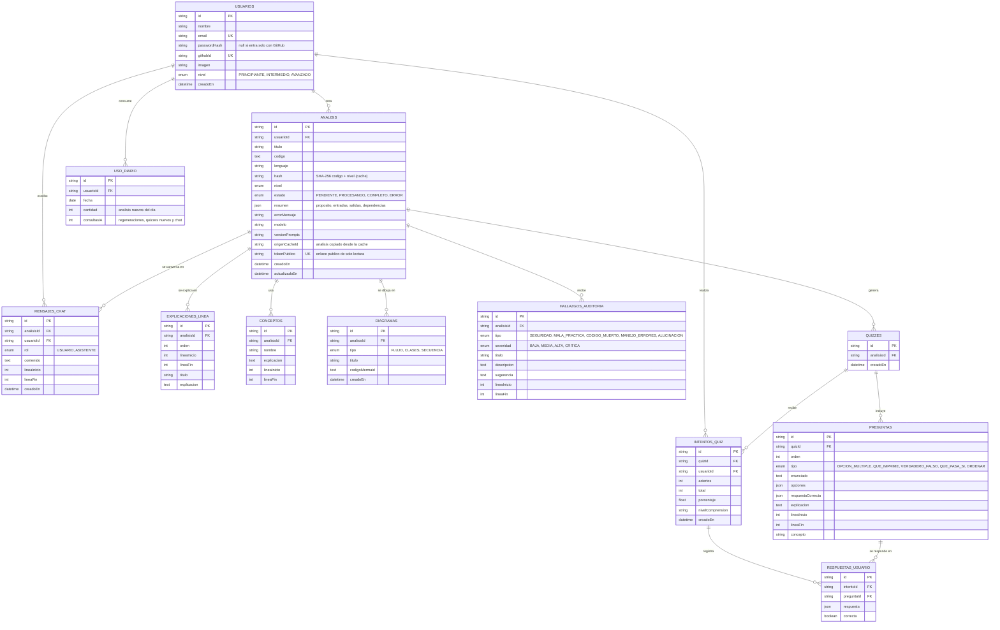

# Diagrama entidad-relación

Las 12 tablas del esquema (`prisma/schema.prisma`). Todas las relaciones hijas usan `ON DELETE CASCADE`: al borrar un análisis se borran sus explicaciones, diagramas, hallazgos, quizzes y chat.

Restricciones únicas relevantes: `usuarios.email`, `usuarios.githubId`, `diagramas(analisisId, tipo)`, `respuestas_usuario(intentoId, preguntaId)` y `uso_diario(usuarioId, fecha)` (una fila por usuario y día para el límite diario de la Fase 2).
